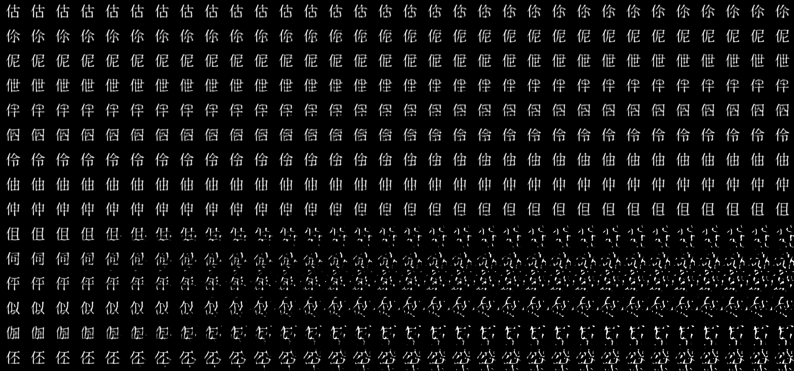

# VAE in TensorFlow
Right now it is set up to reconstruct Kanji (see `text_data.py`)
`run_interpolation.py` will interpolate in z-space and reconstruct

## Usage
` python3 run_train.py run &&  python3 run_interpolate.py run && google-chrome vae-interpolation.png `
